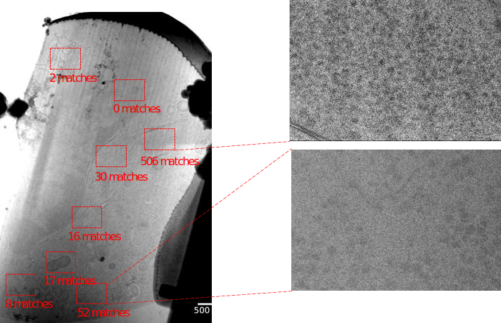

## Figures

{#fig:initmatching}

{#fig:approach}

```{.tikz-figure #example-figure width=16cm height=13cm draft=true}
\node (anchor) at (0.5,9.35) {}; 
\node[labelNode] {A};
\node[graphicNode] {\includegraphics[scale=0.1]{content/graphics/approach/approach.pdf}

};
\iftoggle{draft}{\node [redAnchorNode] {};};
```
