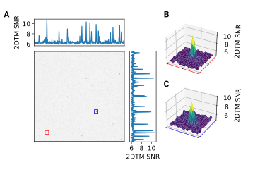

---
author-meta:
- Johannes Elferich
- Nikolaus Grigorieff
bibliography:
- content/manual-references.json
date-meta: 2022-03-28
header-includes: |
  ```{=html}
  <!--
  Manubot generated metadata rendered from header-includes-template.html.
  Suggest improvements at https://github.com/manubot/manubot/blob/main/manubot/process/header-includes-template.html
  -->
  ```
  ```{=html}
  <meta name="dc.format" content="text/html" />
  ```
  ```{=html}
  <meta name="dc.title" content="Visual proteomics using whole-lamella 2D template matching" />
  ```
  ```{=html}
  <meta name="citation_title" content="Visual proteomics using whole-lamella 2D template matching" />
  ```
  ```{=html}
  <meta property="og:title" content="Visual proteomics using whole-lamella 2D template matching" />
  ```
  ```{=html}
  <meta property="twitter:title" content="Visual proteomics using whole-lamella 2D template matching" />
  ```
  ```{=html}
  <meta name="dc.date" content="2022-03-28" />
  ```
  ```{=html}
  <meta name="citation_publication_date" content="2022-03-28" />
  ```
  ```{=html}
  <meta name="dc.language" content="en-US" />
  ```
  ```{=html}
  <meta name="citation_language" content="en-US" />
  ```
  ```{=html}
  <meta name="dc.relation.ispartof" content="Manubot" />
  ```
  ```{=html}
  <meta name="dc.publisher" content="Manubot" />
  ```
  ```{=html}
  <meta name="citation_journal_title" content="Manubot" />
  ```
  ```{=html}
  <meta name="citation_technical_report_institution" content="Manubot" />
  ```
  ```{=html}
  <meta name="citation_author" content="Johannes Elferich" />
  ```
  ```{=html}
  <meta name="citation_author_institution" content="RNA Therapeutic Institute, UMass Chan Medical School" />
  ```
  ```{=html}
  <meta name="citation_author_institution" content="HHMI" />
  ```
  ```{=html}
  <meta name="citation_author_orcid" content="0000-0002-9911-706X" />
  ```
  ```{=html}
  <meta name="citation_author" content="Nikolaus Grigorieff" />
  ```
  ```{=html}
  <meta name="citation_author_institution" content="RNA Therapeutic Institute, UMass Chan Medical School" />
  ```
  ```{=html}
  <meta name="citation_author_institution" content="HHMI" />
  ```
  ```{=html}
  <meta name="citation_author_orcid" content="0000-0002-1506-909X" />
  ```
  `<link rel="canonical" href="https://jojoelfe.github.io/deco_lace_template_matching_manuscript/" />`{=html}
  ```{=html}
  <meta property="og:url" content="https://jojoelfe.github.io/deco_lace_template_matching_manuscript/" />
  ```
  ```{=html}
  <meta property="twitter:url" content="https://jojoelfe.github.io/deco_lace_template_matching_manuscript/" />
  ```
  ```{=html}
  <meta name="citation_fulltext_html_url" content="https://jojoelfe.github.io/deco_lace_template_matching_manuscript/" />
  ```
  ```{=html}
  <meta name="citation_pdf_url" content="https://jojoelfe.github.io/deco_lace_template_matching_manuscript/manuscript.pdf" />
  ```
  `<link rel="alternate" type="application/pdf" href="https://jojoelfe.github.io/deco_lace_template_matching_manuscript/manuscript.pdf" />`{=html}
  `<link rel="alternate" type="text/html" href="https://jojoelfe.github.io/deco_lace_template_matching_manuscript/v/a352115c27ccb3b7fa2977015e71c3c7dbb4f954/" />`{=html}
  ```{=html}
  <meta name="manubot_html_url_versioned" content="https://jojoelfe.github.io/deco_lace_template_matching_manuscript/v/a352115c27ccb3b7fa2977015e71c3c7dbb4f954/" />
  ```
  ```{=html}
  <meta name="manubot_pdf_url_versioned" content="https://jojoelfe.github.io/deco_lace_template_matching_manuscript/v/a352115c27ccb3b7fa2977015e71c3c7dbb4f954/manuscript.pdf" />
  ```
  ```{=html}
  <meta property="og:type" content="article" />
  ```
  ```{=html}
  <meta property="twitter:card" content="summary_large_image" />
  ```
  `<link rel="icon" type="image/png" sizes="192x192" href="https://manubot.org/favicon-192x192.png" />`{=html}
  `<link rel="mask-icon" href="https://manubot.org/safari-pinned-tab.svg" color="#ad1457" />`{=html}
  ```{=html}
  <meta name="theme-color" content="#ad1457" />
  ```
  ```{=html}
  <!-- end Manubot generated metadata -->
  ```
keywords:
- cryo-EM
- visual protemics
- ribosome
lang: en-US
manubot-clear-requests-cache: false
manubot-output-bibliography: output/references.json
manubot-output-citekeys: output/citations.tsv
manubot-requests-cache-path: ci/cache/requests-cache
title: Visual proteomics using whole-lamella 2D template matching
---

```{=html}
<!--
Manubot generated metadata rendered from header-includes-template.html.
Suggest improvements at https://github.com/manubot/manubot/blob/main/manubot/process/header-includes-template.html
-->
```
```{=html}
<meta name="dc.format" content="text/html" />
```
```{=html}
<meta name="dc.title" content="Visual proteomics using whole-lamella 2D template matching" />
```
```{=html}
<meta name="citation_title" content="Visual proteomics using whole-lamella 2D template matching" />
```
```{=html}
<meta property="og:title" content="Visual proteomics using whole-lamella 2D template matching" />
```
```{=html}
<meta property="twitter:title" content="Visual proteomics using whole-lamella 2D template matching" />
```
```{=html}
<meta name="dc.date" content="2022-03-28" />
```
```{=html}
<meta name="citation_publication_date" content="2022-03-28" />
```
```{=html}
<meta name="dc.language" content="en-US" />
```
```{=html}
<meta name="citation_language" content="en-US" />
```
```{=html}
<meta name="dc.relation.ispartof" content="Manubot" />
```
```{=html}
<meta name="dc.publisher" content="Manubot" />
```
```{=html}
<meta name="citation_journal_title" content="Manubot" />
```
```{=html}
<meta name="citation_technical_report_institution" content="Manubot" />
```
```{=html}
<meta name="citation_author" content="Johannes Elferich" />
```
```{=html}
<meta name="citation_author_institution" content="RNA Therapeutic Institute, UMass Chan Medical School" />
```
```{=html}
<meta name="citation_author_institution" content="HHMI" />
```
```{=html}
<meta name="citation_author_orcid" content="0000-0002-9911-706X" />
```
```{=html}
<meta name="citation_author" content="Nikolaus Grigorieff" />
```
```{=html}
<meta name="citation_author_institution" content="RNA Therapeutic Institute, UMass Chan Medical School" />
```
```{=html}
<meta name="citation_author_institution" content="HHMI" />
```
```{=html}
<meta name="citation_author_orcid" content="0000-0002-1506-909X" />
```
`<link rel="canonical" href="https://jojoelfe.github.io/deco_lace_template_matching_manuscript/" />`{=html}
```{=html}
<meta property="og:url" content="https://jojoelfe.github.io/deco_lace_template_matching_manuscript/" />
```
```{=html}
<meta property="twitter:url" content="https://jojoelfe.github.io/deco_lace_template_matching_manuscript/" />
```
```{=html}
<meta name="citation_fulltext_html_url" content="https://jojoelfe.github.io/deco_lace_template_matching_manuscript/" />
```
```{=html}
<meta name="citation_pdf_url" content="https://jojoelfe.github.io/deco_lace_template_matching_manuscript/manuscript.pdf" />
```
`<link rel="alternate" type="application/pdf" href="https://jojoelfe.github.io/deco_lace_template_matching_manuscript/manuscript.pdf" />`{=html}
`<link rel="alternate" type="text/html" href="https://jojoelfe.github.io/deco_lace_template_matching_manuscript/v/a352115c27ccb3b7fa2977015e71c3c7dbb4f954/" />`{=html}
```{=html}
<meta name="manubot_html_url_versioned" content="https://jojoelfe.github.io/deco_lace_template_matching_manuscript/v/a352115c27ccb3b7fa2977015e71c3c7dbb4f954/" />
```
```{=html}
<meta name="manubot_pdf_url_versioned" content="https://jojoelfe.github.io/deco_lace_template_matching_manuscript/v/a352115c27ccb3b7fa2977015e71c3c7dbb4f954/manuscript.pdf" />
```
```{=html}
<meta property="og:type" content="article" />
```
```{=html}
<meta property="twitter:card" content="summary_large_image" />
```
`<link rel="icon" type="image/png" sizes="192x192" href="https://manubot.org/favicon-192x192.png" />`{=html}
`<link rel="mask-icon" href="https://manubot.org/safari-pinned-tab.svg" color="#ad1457" />`{=html}
```{=html}
<meta name="theme-color" content="#ad1457" />
```
```{=html}
<!-- end Manubot generated metadata -->
```

`<small>`{=html}`<em>`{=html}
This manuscript
([permalink](https://jojoelfe.github.io/deco_lace_template_matching_manuscript/v/a352115c27ccb3b7fa2977015e71c3c7dbb4f954/))
was automatically generated
from [jojoelfe/deco_lace_template_matching_manuscript@a352115](https://github.com/jojoelfe/deco_lace_template_matching_manuscript/tree/a352115c27ccb3b7fa2977015e71c3c7dbb4f954)
on March 28, 2022.
`</em>`{=html}`</small>`{=html}

## Authors

-   **Johannes Elferich**`<br>`{=html}
    {.inline_icon width="16" height="16"}
    [0000-0002-9911-706X](https://orcid.org/0000-0002-9911-706X)
    · {.inline_icon width="16" height="16"}
    [jojoelfe](https://github.com/jojoelfe)`<br>`{=html}
    `<small>`{=html}
    RNA Therapeutic Institute, UMass Chan Medical School; HHMI
    `</small>`{=html}

-   **Nikolaus Grigorieff**`<br>`{=html}
    {.inline_icon width="16" height="16"}
    [0000-0002-1506-909X](https://orcid.org/0000-0002-1506-909X)
    · {.inline_icon width="16" height="16"}
    [nikogrigorieff](https://github.com/nikogrigorieff)`<br>`{=html}
    `<small>`{=html}
    RNA Therapeutic Institute, UMass Chan Medical School; HHMI
    `</small>`{=html}

## Abstract {#abstract .page_break_before}

Localization of biomolecules inside a cell is an important goal of biological
imaging. Fluorescence microscopy can localize biomolecules inside whole cells
and tissues, but its ability to count biomolecules and accuracy of the spatial
coordinates is limited by the wavelength of visible light. Cryo-electron
microscopy (cryo-EM) provides highly accurate position and orientation
information of biomolecules but is often confined to small fields of view inside
a cell, limiting biological context. In this study we use a new data-acquisition
scheme called "Defocus-Corrected Large-Area cryo-EM" (DeCo-LACE) to collect
high-resolution cryo-EM data over entire sections (100 -- 200 nm thick lamellae)
of neutrophil-like mouse cells, representing roughly 1% of the total cellular
volume. We use 2D template matching (2DTM) to determine localization and orientation
of the large ribosomal subunit in these sections, detect bound small
ribosomal subunits and assign ribosomes to polysomes based on their relative orientations to each other. These data provide "maps" of translational activity across
sections of mammalian cells. This new high-throughput cryo-EM
data collection approach together with 2DTM will advance visual
proteomics and complement other single-cell "omics" techniques, such as
flow-cytometry and single-cell sequencing.

## Introduction

A major goal in understanding cellular processes is the knowledge of the
amounts, location, interactions, and conformations of biomolecules
inside the cell. This knowledge can be obtained by approaches broadly
divided into label- and label-free techniques. In label-dependent
techniques a probe is physically attached to a molecule of interest that
is able to detected with a high signal-to-noise signal, such as a
fluorescent molecule. In label-free techniques the physical properties
of molecules themselves are used for detection. An example for this is
proteomics using mass-spectrometry [@doi:10.1038/nbt.1592]. The advantage
of label-free techniques is that they can provide information over
thousands of molecules, while label-techniques offer highly specific
information for a few molecules. Especially spatial information can
often only be achieved using label-dependent techniques, such as
fluorescence microscopy [@doi:10.1038/nmeth817].

Cryo-electron microscopy has the potential to directly visualize the
arrangement of atoms that compose biomolecules inside of cells, thereby
allowing label-free detection with high spatial accuracy. This has been
called "visual proteomics" [@doi:10.1038/nrm1861]. Since cryo-EM
requires thin samples (\<500nm), imaging of biomolecules inside cells is
restricted to small organisms, thin regions of cells, or samples that
have been suitably thinned. Thinning can be achieved either by
mechanical sectioning [@doi:10.1111/j.1365-2818.1983.tb04225.x] or by
milling using a focused ion beam (FIB) [@doi:10.1016/j.sbi.2013.08.006]. his complex workflow
leads to a low throughput of cryo-EM imaging of cells and is further
limited by the fact that at the required magnifications, typical fields
of view (FOV) are very small compared to mammalian cells, and the FOV
achieved by label-techniques such as fluorescence light microscopy. The
predominant cryo-EM technique for the localization of biomolecules of
defined size and shape inside cells is cryo-electron tomography [@doi:10.1017/S0033583511000102]. However, the requirement of a tilt series at
every imaged location and subsequent image alignment, severely limits
the throughput for molecular localization.

An alternative approach is to identify molecules by their structural
"fingerprint" in single projection using "2D template-matching" (2DTM)
[@doi:10.7554/eLife.25648; @doi:10.1101/2020.04.22.053868; @doi:10.7554/eLife.68946]. In this
method a 3D model of a biomolecule is used as a template to find 2D
projections that match the molecules visible in the electron
micrographs. This method requires a projection search on a fine angular
grid, and the projections are used to find local cross-correlation peaks
with the micrograph. Since the location of a biomolecule in the
z-direction causes predictable aberrations to the projection image, this
method can be used to calculate complete 3D coordinates and orientations
of a biomolecule in a cellular sample
[@doi:10.1101/2020.04.22.053868]

Hematopoiesis is the process of generating the various cell types of the blood in
the bone marrow. Disregulation of the process results in diseases like leukemia.
Understanding how hematopoietic stem and progenitor cells are programmed to
diffferentiate to the appropriate cell type would be provide new insight how
hematopoiesis can be misregulated. Of special interest is the regulation of
translation during hematopoiesis. This is exemplified by the observation that
genetic defects in the ribosome machinery often leads to hematopoietic
disease[@doi:10.1093/nar/gkz637]. As such direct quantification of ribosome
location, number and conformational states could lead to new insight into
hematopoietic disease [@doi:10.1186/s12885-018-4178-z].

Here we apply 2D-template matching of ribosomes to cryo-FIB milled
neutrophil-like murine cells [@doi:10.1016/j.cell.2016.08.057]. To increase the
amount of collected data and to provide unbiased sampling of the whole
lamella, we devised a new data-acquisition scheme, Defocus-corrected
large area cryo-electron microscopy (DeCo-LACE). We characterize
aberration cause by the used large beam-image shifts and highly focused
beams and find that they can be adequately corrected to enable ribosome
detection by 2DTM. The resulting data provide a description of ribosome
distribution in the whole lamellae, which represent roughly 2% of the
cellular volume. We find highly heterogeneous density of ribosome within
the cell and can identify discrete clusters of presumably
translationally active ribosomes, by testing for the presence of the
small ribosomal subunit. The high accuracy of location and orientation
of each detected ribosome also allows us to cluster ribosome molecules
into potential polysomes. Analysis of the throughput in this method
suggests that for the foreseeable future computation will be the
bottleneck for visual proteomics.

## Materials and Methods

### Grid preparation

ER-HoxA9 cells were maintained in RPMI supplemented with 10% FBS,
penicillin/streptomycin, SCF, and estrogen [@doi:10.1016/j.cell.2016.08.057] at
37C and 5% CO2. 120h prior to grid freezing cells were washed twice in PBS and
cultured in the same medium, except without estrogen. Differentiation was
verified by staining with Hoechst-dye and insepction of nuclear morphology.
Cells were then counted and diluted to 1\^106 cells/ml. Grids ( either 200 mesh
copper grids, with a sillicone-oxide and 2um holes with a 2um spacing or 200
mesh gold grids with a thin gold film and 2 um holes in 2um sapcing) were
glow-discharged from both sides using a ... for ... . 3.5 ul of cells suspension
was added to grids on the thin-film side and grids were automatically blotted
from the back-side using a GP2 cryoplunger (Leica) for ... s and rapidly plunged
into liquid ethane at -185C.

### FIB-milling

Grids were loaded into a Acquilos 2 FIB/SEM microscope with a stage cooled to
-190C. Grids were sputter-coated with platinum for 15s at 45 mA and then coated
with a layer of platinum-precursor by openin the GIS-valve for 45s. An overview
of the grid was created by montaging SEM images and isolated cells at the center
of gridsquares were selected for FB-milling. Lamella were generated
automatically using the AutoTEM software, resulting in 6-8 um wide lamella with
150-200 um thickness as determined by FIB-imaging of the lamella edge.

### Data collection

Grids were loaded into a Krios Titam TEM operated at 300 keV. The microscope was
setup with a cross-grating grid on the stageby setting the beam-diameter to 900
nm, resulting in the beam being completely visible in the camera. To establish
fringe-free conditions, the "Fine eucentric" procedure of serialEM was used to
move a square of the cross-grating grid to the eucentric position of the
microscope. The effective defocus was then set to 2 um, using the "autofocus"
routine of serialEM. The objective focus of the microscope was changed until no
fringes were visible. The stage was then moved in Z until images had a apparent
defocus of 2 um. The differnce in stage Z-position between the eucentric and
fringe-free conditions was calculate d and noted to move other areas into
fringe-free condition.

Low magnification montages were used to find lamella and lamella that were
sufficiently thin and free of contamination were selected for automated data
collection. The corners of the lamella were manually annotated in SerialEM and
translated into Beam-Imageshift values using SerialEm calibration. A hexagonal
patter of beam-imageshift positions was calculated that covered the area between
he four corners in a serpentine way, with a sqrt(3) \* 400 nm horizontal spacing
and 800 nm vertical spacing. Exposures were then taking at each position with a
30 e/A total dose. After each exposure that defocus was estimated using the
ctffind function of SerialEM and the focus for th next exposure was corrected by
the difference between the estimated focus and the desired defocus of 800 um.
Also after each exposure the deviation of the beam from the center of the camera
was measured and corrected using the "CenterBeamFrom IMage" command of SerialEM.

After datacollection a 20s exposure at 2250x magnification of the lamella at
200um defocus was taken for visualization purposes.

### Data pre-processing

Movies were gain-corrected and motion-corrected using a custom version of
unblur. To avoid influence of the beam-edge on motion-correction only a quarter
of the movie in the center of the camera was considered for calculation of the
estimated motion. After movie frames were aligned and summed a mask for the
illuminated area was calculated by lowpass filtering the image at ... A,
thresholding the image at 10% of the maximal value and then lowpass filtering
the mask at ... A. This mask was then used to replace un-illuminated area with
gaussian noise, with the same mean and standard deviation as the illuminated
area. The contrast-transfer function (CTF) was estimated using ctffind, searching
between 0.02 and 2 um defocus.

### Template matching

The search template was generated from the cryo-EM structure of the mouse large
ribosomal subunit (PDB 6SWA). The ... subunit was deleted from the model and the
simulate program of the cisTEM suite was used to calculate an density map from
the atomic coordinates. The match_template program was used to search for this
template in the preprocessed images, using 1.5 deg angular step in out-of-plane
angles and 1.0 deg in-plane. 21 defocus planes in 200nm steps centered around
the defocus estimates by ctffind were searches. Matches were defined as peaks
above a threshold calulated according to .. .(7.75 for most images).

### Data analysis

## Results

### 2D-Template matching can be used to find ribosomal subunits in cryo-FIB thinned lamella of mammalian cells

To test whether we could detect individual ribosomes in mammalian cells we
prepared cryo-lamella of mouse neutrophil-like cells. Low-magnification images
of these lamellas clearly shows cellular features consistent with a
neutrophil-like phenotype, mainly a segmented nucleus and a plethora of
membrane-organelles, corresponding to the granules and secretory vesicles of
neutrophils. We then proceeded to acquire micrographs on this lamella with a
defocus of 0.5-1.0 um, 30 e/A2/s exposure and 1.5 A pixelsize. We manually
selected multiple locations in the lamella and focused using standard low-dose
techniques, i.e. by first ensuring correct focus by imaging a sacrifical area.
The resoluting micrographs showed no signs of crystalline ice and had thon-rings
to resolution, indicating successfull vitrification.

We used an atomic model of the 60S mouse ribosomal subunit (6SWA) for 2D
template matching. In a subset of images the distribution of cross-correlation
scores significantly exceeded the distribution expected from non-signifcant
matching(Figure 1B). In the resulting scaled maximum-intensity maps, clear peaks
with SNR thresholds up to 10 were apparent (Figure 1C). By using the criterion
described by for thresholding potential matches we found that in images of
cytosolic ompartments we found evidence of 10-500 ribosomes in the imaged areas.
Notably we found no matches in images that were taken in the nuclear
compartment. In the cytosolic areas we found a drastically different number of
matches, In somer areas we found only \~ 50 matches er image area, corresponding
to a concentration of..., while in another area we found more than 500 matches,
corresponding to a concentration of ... .

### cryo-EMILIA for 2D imaging of whole lamella

In order to obtain high-resolution data for complete lamella we used a new
approach for data collection. This approach uses three key strategies: (1)
ensures that every electron that exposes the sample is collected on the camera
(2) uses beam-image shift to precisely and quickly raster the surface of the
lamella and (3) uses a focusing strategy that does not rely on a sacrificial
area.

To ensure that every electron exposing the sample was captured by the detector,
we focused the electron beam so that the entire beam was placed on the detector.
During canonical low-dose imaging the microscope is configured so that the focal
plan is identical to the eucentric plane of the specimen stage. This leaves the
C2 aperture out of focus, resulting in ripples at the edge of the beam (Figure
2B). While these ripples are low-resolution features that might not interfere
with 2D template matching, which is designed to be robust to low-resolution
noise, we also tested collecting data under a condition where the C2 aperture is
in focus (Figure 2C).

We then centered a lamella under the electron beam and used beam-image shift of
the microscope to systematically raster the whole surface of the lamella in a
hexagonal pattern. Instead of focusing in a sacrificial area, we determined the
defocus after every exposure using a routine implemented in SerialEM modeled
after CTFFind. The focus was then adjusted based on the difference between
desired and measured defocus. Since we used a serpentine pattern for data
collection every exposure is close to the previous exposure making drastic
changes in the defocus unlikely. Furthermore we started our acquisition pattern
on the platinum deposition edge, so the initial exposure where the defocus was
not yet adjusted did not contain any biologically relevant information.

We used this strategy to collect data on 8 lamella, 4 using the eucentric focus
condition and 4 using the fringe-free condition. We were able to highly
consistently collect data with a defocus of 8 um (Figure 2D), both in the
eucentric focus and fringe-free focus condition. Together with the nominal
defocus of the microscope this data results in a topological map of the lamella.
To ensure that data was collected consistently, we mapped defocus values as a
function of the applied Beam-image shift (Figure 2E). This demonstrated that the
defocus was consistent over the lamella, with outliers only at isolated images
and in images containing contamination. We also plotted the measure objective
astigmatism of the lamella and found that it varies with the applied Beam-image
shift, become more astigmatic mostly due to beam-image shift in the X
direction. While approaches exist to correct this during the data-collection, we
opted to not use these mechanism for these early experiments and instead rely on
computational correction of these aberrations in order to characterize them.

### 2D-Template matching of cryo-EMILIA data reveals ribosome distribution

We developed customized preprocessing protocol to images obtained by cryo-EMILIA
to enable their use for 2D-template matching. First we restricted calculation of
cross-correlation coefficients between individual movie frames to the central
portion of the image to prevent artifacts from the beam edges on estimation of
motion. Then we calculated a mask that defined the illuminated area of the
micrographs and used it to fill non-illumated areas with gaussian noise,
matching mean and standard deviation to the illuminated signal (Figure 3A). The
so processed images were suitable for 2D-template matching and we were able to
obtained matches with the same model used for the data in Figure 1.

### Quantitative analysis of translation activity

## Discussion

-   Elizabeth Wright and Grant Jensen Montage tomography papers

-   Waffle method for higher throughput, automation of fib-milling

-   Throughput and bottlenecks

-   Visual proteomics

-   Granules containing ribosomes?

-   Threshold implications (no matches on most images)

## Figures

![2D template matching of the large subunit of the ribosome in fib-milled neutrophil-like cells
(A) Overview image of the lamella. Major cellular regions are labeled, as Nucleus (Nuc), Mitochondria (M), and granular cytoplasm (GrCyt). FOVs where high-magnification images for template matching where acquired are indicated as boxes with the number of matches indicated on the bottom right. FOVs displayed in Panels B-E are color-coded.
(B-E) FOVs with projection of ribosome LSU matches shown in green. (B) Perinuclear region, the only matches are in the cytoplasmic half. (C) Cytoplasmic region with high density of ribosomes (D) Mitochondrium, as expected there are only matches in the cytoplasmic region (E) Cytoplasm, with low density of ribosomes.](figures/initmatching.svg){#fig:initmatching}

{#fig:initmatching2 tag="S1"}

{#fig:approach}

{#fig:lamella_spatial_info}

{#fig:approach3}

{#fig:approach4}

{#fig:matching}

{#fig:deco_lace_workflow}

## References {#references .page_break_before}

```{=html}
<!-- Explicitly insert bibliography here -->
```
